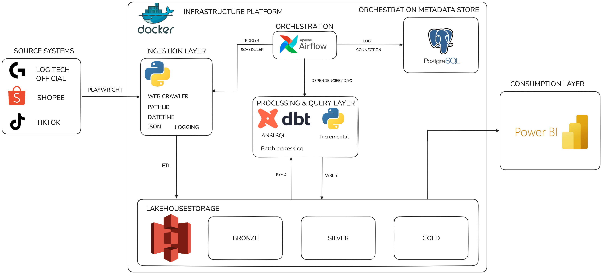

<div align="center">

# Ecommerce Price Gap Tracker

**Automated ELT pipeline for MAP-compliance monitoring across Vietnamese e-commerce channels**

Scrapes Logitech SKU prices from the official store, Shopee, and TikTok Shop, then flags resellers pricing below the official reference.


<p align="center">
    
    
    
    
    
    
    
</p>

`Python` · `Apache Airflow` · `dbt` · `PostgreSQL` · `Playwright` · `Docker` · `Power BI`

</div>

---

## What This Demonstrates

- **Right-sized architecture** — one Postgres instance, no Kafka/Spark/object storage. Data volume (~1 MB/month) doesn't justify them, and unjustified tooling is the failure mode this project explicitly avoids.
- **Idempotent, auditable pipelines** — append-only raw layer, dbt incremental merge for dedup, quarantine table for malformed records.
- **Production habits at portfolio scale** — retry/backoff, schema tests, dependency-ordered orchestration, reproducible environment.

## Business Problem

Unauthorized resellers undercut official pricing on marketplaces, eroding brand trust and margin for authorized channels. Manual cross-channel price checks don't scale and produce stale, inconsistent snapshots.

**The question this pipeline answers:** *Which SKUs and sellers on Shopee/TikTok are currently priced below Logitech's official reference price — and by how much?*

<details>
<summary><strong>Planned Power BI views (10)</strong></summary>
<br>

| # | View | Question it answers |
|---|---|---|
| 1 | Price Gap % | Distance from official reference price, per SKU per day |
| 2 | Anomaly Alert Table | SKUs priced >15% below reference — likely grey-market stock |
| 3 | Seller Compliance Ranking | Which sellers repeatedly violate MAP? |
| 4 | Price Volatility Index | Which SKUs swing most day-to-day? |
| 5 | Historical Price Trend | Price movement across three channels over sale cycles |
| 6 | Discount Depth Distribution | How aggressive is each channel's discounting? |
| 7 | Pipeline Health Tile | Last successful scrape per source; failure frequency |
| 8 | Stock Availability Tracker | Do suspicious sellers sell out unusually fast? |
| 9 | Cross-Channel Consistency | Same SKU, different price between TikTok and Shopee? |
| 10 | Weekly Executive Summary | Top 3 SKUs with the largest deviation this week |

</details>

## Architecture



> **Design note:** the diagram shows the initial design with a dedicated "Orchestration Metadata Store" Postgres instance. That instance was cut — Airflow already needs a metadata database, so a second Postgres duplicates it without adding capability. The current plan runs a **single Postgres instance** with two schemas: `airflow` (orchestrator metadata) and `warehouse` (raw/staging/mart).


## Tech Stack Rationale

| Tool | Why it's here | What breaks without it |
|---|---|---|
| **Playwright** | Marketplace pages render client-side JS | No usable HTML to parse |
| **Pandas / NumPy** | Structural validation at the ingestion layer | Malformed records reach the warehouse undetected |
| **Airflow** | Scrape → stage → transform must run in order; a failed step must not corrupt downstream data | Independent cron jobs give no dependency guarantee |
| **dbt** | Window functions, schema tests, incremental merge — with lineage | Ad hoc SQL: no lineage, no quality gate, full reprocessing every run |
| **PostgreSQL** | Sufficient relational store at this volume | N/A — no case for more at this scale |
| **Docker Compose** | Reproducible environment for reviewers | Manual setup replication required |
| **Power BI** | Consumption layer | N/A |

## Challenges & Solutions

| Challenge | Solution |
|---|---|
| Anti-bot / selector instability | Validated selectors manually against a single SKU **before** writing any DAG |
| Transient scrape failures | `tenacity` exponential backoff + randomized 3–8s delays |
| Re-runs must not duplicate rows | dbt incremental merge (`unique_key`) — no redundant "dedup DAG" |
| Malformed price fields after cast | Routed to `quarantine`, never silently into `mart` |
| Marketplace ToS | Rate-limited, respects `robots.txt`; cached HTML samples enable offline demo |

## Roadmap

| Week | Phase | Status |
|---|---|---|
| 1–2 | Playwright validation + raw ingestion (2–3 SKUs) | 🟡 In progress |
| 3–4 | Postgres schema + Docker Compose | ⚪ Planned |
| 5–6 | dbt transformations + Airflow orchestration | ⚪ Planned |
| 7–8 | Power BI dashboards + polish | ⚪ Planned |

## Setup

> Weeks 1–2 cover the crawler only. Postgres, Docker Compose, dbt, and Airflow arrive in weeks 3–6.

```bash
git clone https://github.com/wayneworkspace/Ecommerce_Price_Gap_Tracker.git
cd Ecommerce_Price_Gap_Tracker

pip install -e ".[crawler,dev]"   # crawler = patchright + tenacity, dev = pytest
patchright install chrome         # real Chrome, not bundled Chromium
cp .env.example .env
```

One required variable in `.env`:

| Variable | Purpose |
|---|---|
| `SHOPEE_USER_DATA_DIR` | Path to the Chrome persistent profile holding your logged-in Shopee session. Shopee walls off anonymous sessions — no session, no scrape. See `docs/decisions/0004`. |

Log in once, by hand (persists in the profile; repeat only when the session expires):

```bash
python scripts/shopee_login.py
```

Run the pipeline and tests:

```bash
price-tracker-shopee   # writes to data/raw/ and data/staging/; SKUs configured in config/skus.yaml
pytest                 # no network, browser, or .env needed
```

## Data Model (planned)

| Table | Contents |
|---|---|
| `raw_prices` | `sku_id`, `source`, `seller_id`, `product_name`, `price`, `url`, `scraped_at` |
| `staging_prices` | Cast + deduplicated |
| `mart_price_gap` | `sku_id`, `source`, `price`, `price_change_pct` (day-over-day via `LAG()`) |
