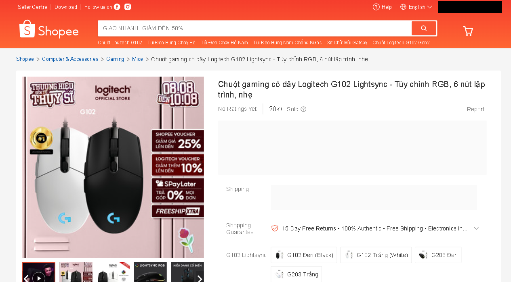

## Issue Log — Shopee Playwright Scraper

### Issue 1: Blocked with "Login Required" (redirected to /verify/traffic/error)

**Evidence:**

Direct navigation via Playwright/Chromium:


Same block reproduced on a real phone, different network (5G), no automation involved — rules out bot fingerprinting as the cause at this layer:


**Reason:**
- Shopee redirects any anonymous session (`is_logged_in=false`) straight to a login-wall page when navigating directly to a product detail URL.
- Confirmed this is not Playwright-specific: the same block occurred on a real mobile browser, on a different network (5G), with no automation involved at all — ruling out bot fingerprinting as the cause at this layer.

**Solve:**
- Launch the browser with `launch_persistent_context()` instead of `launch()`, pointing to a dedicated `user_data_dir`.
- Log in manually once inside that persistent profile; cookies/session are then retained automatically across future runs — no login wall on subsequent visits.

---

### Issue 2: Blocked with anti-bot captcha (`/verify/captcha?anti_bot_tracking_id=...`) despite being logged in

**Reason:**
- Cookies exported via `storage_state.json` and re-injected into a *fresh* Chromium context carry session tokens (e.g. `SPC_SEC_SI`) that are tied to the device fingerprint present at login time.
- A new, separate Chromium instance has a different fingerprint than the one that created the cookies — Shopee flags the mismatch as suspicious and triggers a captcha wall.

**Solve:**
- Stop exporting/re-importing cookies as a separate file.
- Keep everything inside the same `launch_persistent_context()` profile so the browser fingerprint stays consistent between the login session and every later scrape — no fingerprint mismatch to flag.

---

### Issue 3: Blocked with anti-bot captcha even in a clean, fresh, real-Chrome persistent profile

**Evidence:**


**Reason:**
- Even with real Chrome (`channel="chrome"`), a brand-new persistent profile, and no prior automation history, the captcha still triggered — this time at the very first login attempt.
- Root cause: Shopee's anti-bot system (URL pattern consistent with Akamai Bot Manager) detects the Chrome DevTools Protocol (CDP) connection itself — the mechanism Playwright uses to control the browser — regardless of fingerprint or login state.

**Solve:**
- Installed `playwright-stealth` (`stealth_sync(page)`), which patches multiple automation-detection signals at once (beyond the single `navigator.webdriver` flag), applied immediately after page creation and before any navigation.
- Combined with the persistent profile from Issue 1/2, this consistently reached the product page without triggering the anti-bot wall.
- **Update:** this fix was later replaced entirely — see Issue 4. `playwright-stealth` is no longer used in the final scraper.

---

### Issue 4: `playwright-stealth` avoids the captcha but breaks Shopee's own page JavaScript (price never renders)

**Evidence:**

Console showed a cascade of errors starting from the stealth patch itself, then breaking Shopee's own inline scripts:

```
Uncaught Error: skipping chrome loadtimes update, running in headfull mode
Uncaught ReferenceError: utils is not defined
Uncaught ReferenceError: opts is not defined
Uncaught ReferenceError: BROWSER_YEAR is not defined
```

The rendered page showed the product title, images, and breadcrumb (server-rendered, no JS required) correctly, but the price widget and shipping info stayed as empty grey placeholder boxes forever — the client-side fetch/render logic for those sections never ran.

**Reason:**
- `playwright-stealth`'s injected patch for `chrome.loadTimes` throws an uncaught error early in page execution on the current Chrome version (151.x) — the library is unmaintained and not tested against modern Chrome.
- That early crash breaks the execution order of Shopee's own inline `<script>` tags, so globals like `utils` and `opts` (defined by scripts that never got to run) are undefined for everything downstream — including the component responsible for fetching and rendering price.
- Removing `stealth_sync` fixes the JS crash but reintroduces Issue 3's CDP-detection captcha — a genuine dead end with this library.

**Solve:**
- Replaced `playwright` + `playwright-stealth` with **`patchright`** — a Playwright fork that avoids automation detection by patching at the binary/CDP level instead of injecting JavaScript into the page.
- No `stealth_sync()` call needed. Drop-in replacement: `from patchright.sync_api import sync_playwright` instead of `from playwright.sync_api import sync_playwright`.
- Result: no captcha, no JS errors, price and shipping info render correctly.

---

### Issue 5: Price API response consistently arrives late — turned out to be a dispatch-lag bug in the capture code, not Shopee throttling (status: resolved)

**Evidence:**

Page rendered cleanly — title, images, breadcrumb, and logged-in account all correct — but the price box stayed an empty grey placeholder even after waiting 25 seconds:



Console/page-error listeners (`page.on("console")`, `page.on("pageerror")`) were added to rule out a JS crash (the Issue 4 pattern) — no errors were logged, ruling that out.

The key clue: raising the manual wait cutoff from 25s to 40s didn't fix it — the "Captured API response" log line kept appearing 3-4 seconds *after* whatever cutoff was set (28-31s when cutoff=25s, 43-44s when cutoff=40s). The delay tracked the cutoff itself rather than being a fixed number, which ruled out both "Shopee is just slow" and the original rate-limiting hypothesis (a 3-hour cooldown before a retry produced the exact same ~27-30s delay, which a soft throttle should not survive).

**Reason (confirmed):**
- The capture code used a hand-rolled pattern: a `captured` dict written from inside a `page.on("response", ...)` callback, polled from the main thread with `time.sleep(0.5)` in a loop.
- Patchright/Playwright's sync API dispatches events (like `response`) on a background thread. In this setup, the Python-level callback wasn't actually invoked until another *synchronous* call into the browser occurred — specifically the `page.screenshot(full_page=True)` taken right after the wait loop gave up (a multi-second call on a ~25,000px-tall page). That call forced the pending event queue to flush, which is why the log line always showed up a few seconds after whatever the timeout was, no matter what the timeout value was set to.
- In short: the response likely arrived on time: the code just wasn't set up to notice until it happened to make another blocking browser call afterward.

**Solve:**
- Replaced the entire hand-rolled `captured` dict + `on_response` callback + polling loop with Playwright's built-in `page.expect_response(predicate, timeout=...)` context manager — the officially supported way to wait for one matching network response. It blocks correctly on the same thread that triggers `page.goto()`, with no dispatch-thread ambiguity.
- Also tightened the match predicate to require both the `pdp/get_pc` path *and* the `item_id` (not `item_id` alone), after this change first surfaced an unrelated response that happened to contain the same `item_id` in its URL but wasn't JSON — added a `try/except json.JSONDecodeError` around `response.json()` so a wrong match triggers a clean retry instead of crashing.
- Result: `fetch_raw()` now succeeds on the very first attempt, no retries needed — confirming the delay was never about Shopee or the network at all.

**Evidence of fix — full pipeline output after the change (no retries, first attempt):**

```json
{
  "sku_id": 6765591429,
  "seller_id": 52679373,
  "product_name": "Chuột gaming có dây Logitech G102 Lightsync - Tùy chỉnh RGB, 6 nút lập trình, nhẹ",
  "price": 489000.0,
  "url": "https://shopee.vn/Chu%E1%BB%99t-gaming-c%C3%B3-d%C3%A2y-Logitech-G102-Lightsync-T%C3%B9y-ch%E1%BB%89nh-RGB-6-n%C3%BAt-l%E1%BA%ADp-tr%C3%ACnh-nh%E1%BA%B9-i.52679373.6765591429",
  "scraped_at": "2026-08-26T03:27:40.989406+00:00"
}
```

(A screenshot was also tried as evidence, but taken right after `expect_response` resolves — at `domcontentloaded`, before Shopee's own JS re-renders the price widget with that data — so it still showed the empty grey placeholder despite the fetch having already succeeded. The JSON output above is the more accurate evidence: it proves the data pipeline works end-to-end, independent of whether the UI has repainted yet.)

---

## Notes — data extraction learnings (not blockers, just corrections)

- The product's title field in the `pdp/get_pc` API response is `"title"`, not `"name"` as initially assumed — update any code that reads `item.get("name")` to `item.get("title")`.
- The API returns multiple price-shaped fields: `price`, `price_min`, `price_max` (variant range) and `price_before_discount`. These are all **list prices**, before any personalized voucher is applied. The price shown on-screen ("After Voucher") is computed client-side from list price minus shop/personal vouchers and will differ per account — for MAP/price-integrity monitoring, `price` (or `price_min`) is the correct field to store in `raw_prices`, not the post-voucher display price.
- `on_response` filters that match generic keys like `"price"` + `"name"` in *any* JSON response are unreliable — Shopee's page loads many unrelated JSON APIs (flash-sale carousels, recommendations) that happen to contain the same key names for *other* products. Filter instead by the known `item_id` from the URL to make sure the captured response is actually for the target product.
