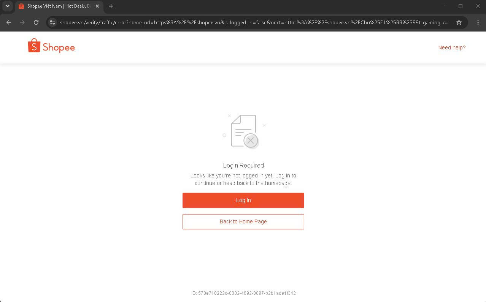
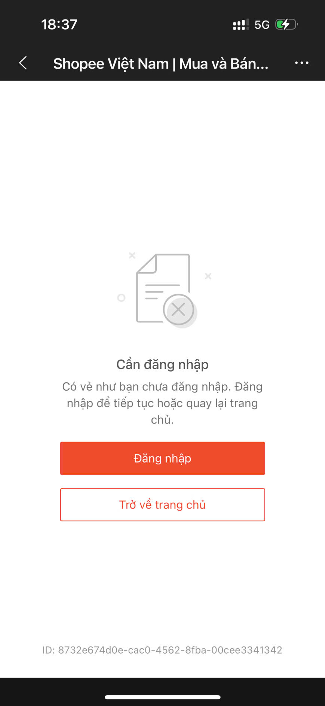
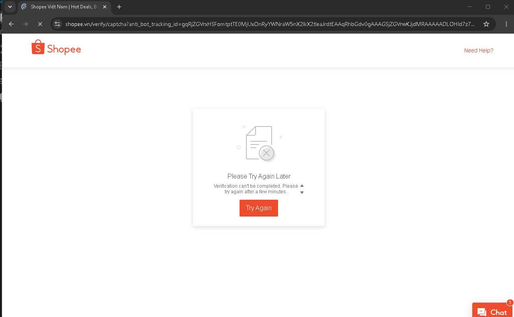

# Issue Log — Shopee Playwright Scraper

## Issue 1: Blocked with "Login Required" (redirected to /verify/traffic/error)

**Evidence:**

Direct navigation via Playwright/Chromium:



Same block reproduced on a real phone, different network (5G), no automation involved — rules out bot fingerprinting as the cause at this layer:



**Reason:**
- Shopee redirects any anonymous session (`is_logged_in=false`) straight to a login-wall page when navigating directly to a product detail URL.
- Confirmed this is not Playwright-specific: the same block occurred on a real mobile browser, on a different network (5G), with no automation involved at all — ruling out bot fingerprinting as the cause at this layer.

**Solve:**
- Launch the browser with `launch_persistent_context()` instead of `launch()`, pointing to a dedicated `user_data_dir`.
- Log in manually once inside that persistent profile; cookies/session are then retained automatically across future runs — no login wall on subsequent visits.

---

## Issue 2: Blocked with anti-bot captcha (`/verify/captcha?anti_bot_tracking_id=...`) despite being logged in

**Reason:**
- Cookies exported via `storage_state.json` and re-injected into a *fresh* Chromium context carry session tokens (e.g. `SPC_SEC_SI`) that are tied to the device fingerprint present at login time.
- A new, separate Chromium instance has a different fingerprint than the one that created the cookies — Shopee flags the mismatch as suspicious and triggers a captcha wall.

**Solve:**
- Stop exporting/re-importing cookies as a separate file.
- Keep everything inside the same `launch_persistent_context()` profile so the browser fingerprint stays consistent between the login session and every later scrape — no fingerprint mismatch to flag.

---

## Issue 3: Blocked with anti-bot captcha even in a clean, fresh, real-Chrome persistent profile

**Evidence:**



**Reason:**
- Even with real Chrome (`channel="chrome"`), a brand-new persistent profile, and no prior automation history, the captcha still triggered — this time at the very first login attempt.
- Root cause: Shopee's anti-bot system (URL pattern consistent with Akamai Bot Manager) detects the Chrome DevTools Protocol (CDP) connection itself — the mechanism Playwright uses to control the browser — regardless of fingerprint or login state.

**Solve:**
- Installed `playwright-stealth` (`stealth_sync(page)`), which patches multiple automation-detection signals at once (beyond the single `navigator.webdriver` flag), applied immediately after page creation and before any navigation.
- Combined with the persistent profile from Issue 1/2, this consistently reached the product page without triggering the anti-bot wall.
- **Update:** this fix was later replaced entirely — see Issue 4. `playwright-stealth` is no longer used in the final scraper.

---

## Issue 4: `playwright-stealth` avoids the captcha but breaks Shopee's own page JavaScript (price never renders)

**Evidence:**

Console showed a cascade of errors starting from the stealth patch itself, then breaking Shopee's own inline scripts:

```
Uncaught Error: skipping chrome loadtimes update, running in headfull mode
Uncaught ReferenceError: utils is not defined
Uncaught ReferenceError: opts is not defined
Uncaught ReferenceError: BROWSER_YEAR is not defined
```

The rendered page showed the product title, images, and breadcrumb (server-rendered, no JS required) correctly, but the price widget and shipping info stayed as empty grey placeholder boxes forever — the client-side fetch/render logic for those sections never ran.

**Reason:**
- `playwright-stealth`'s injected patch for `chrome.loadTimes` throws an uncaught error early in page execution on the current Chrome version (151.x) — the library is unmaintained and not tested against modern Chrome.
- That early crash breaks the execution order of Shopee's own inline `<script>` tags, so globals like `utils` and `opts` (defined by scripts that never got to run) are undefined for everything downstream — including the component responsible for fetching and rendering price.
- Removing `stealth_sync` fixes the JS crash but reintroduces Issue 3's CDP-detection captcha — a genuine dead end with this library.

**Solve:**
- Replaced `playwright` + `playwright-stealth` with **`patchright`** — a Playwright fork that avoids automation detection by patching at the binary/CDP level instead of injecting JavaScript into the page.
- No `stealth_sync()` call needed. Drop-in replacement: `from patchright.sync_api import sync_playwright` instead of `from playwright.sync_api import sync_playwright`.
- Result: no captcha, no JS errors, price and shipping info render correctly.

---

## Notes — data extraction learnings (not blockers, just corrections)

- The product's title field in the `pdp/get_pc` API response is `"title"`, not `"name"` as initially assumed — update any code that reads `item.get("name")` to `item.get("title")`.
- The API returns multiple price-shaped fields: `price`, `price_min`, `price_max` (variant range) and `price_before_discount`. These are all **list prices**, before any personalized voucher is applied. The price shown on-screen ("After Voucher") is computed client-side from list price minus shop/personal vouchers and will differ per account — for MAP/price-integrity monitoring, `price` (or `price_min`) is the correct field to store in `raw_prices`, not the post-voucher display price.
- `on_response` filters that match generic keys like `"price"` + `"name"` in *any* JSON response are unreliable — Shopee's page loads many unrelated JSON APIs (flash-sale carousels, recommendations) that happen to contain the same key names for *other* products. Filter instead by the known `item_id` from the URL to make sure the captured response is actually for the target product.
